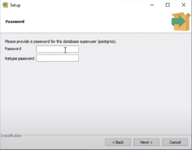

# PostgreSQL

# Installing postgreSQL on Windows

In this guide, we're gonna install postgres on Windows and try running some helpful commands

# Table of Contents

* What is PostgreSQL
* Installing PostgreSQL on Windows
* Quick Run
* Helpful Commands
* Common Problems

# What is PostgreSQL

PostgreSQL is a powerful, open source object-relational database system that uses and extends the SQL language combined with many features that safely store and scale the most complicated data workloads. The origins of PostgreSQL date back to 1986 as part of the POSTGRES project at the University of California at Berkeley and has more than 30 years of activedevelopment on the core platform.

# Installing PostgreSQL on Windows

**_step 1_**: [Download](https://www.enterprisedb.com/downloads/postgres-postgresql-downloads) the latest version according to your system properties, `32 bit` or `64 bit`.

**_step 2_**: Install it like like any other software. 

Leave all the boxes checked when this appears

  

When the prompt asks for a password, enter one you can easily remember (which will be needed later)

Keep pressing Next until you reach this prompt, uncheck the box and finish installation

